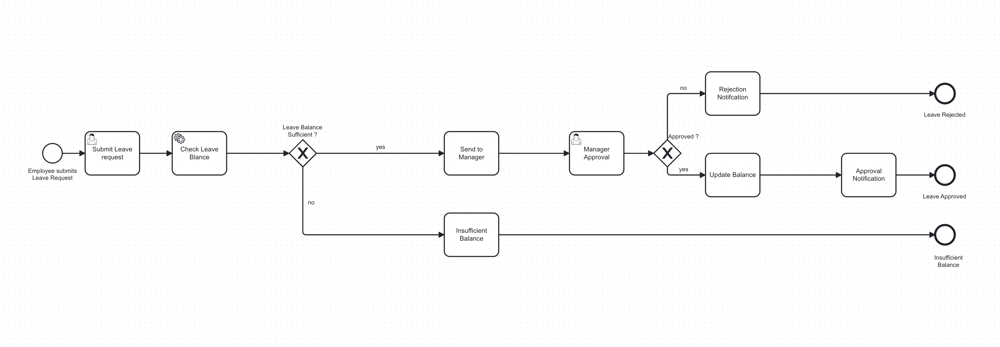
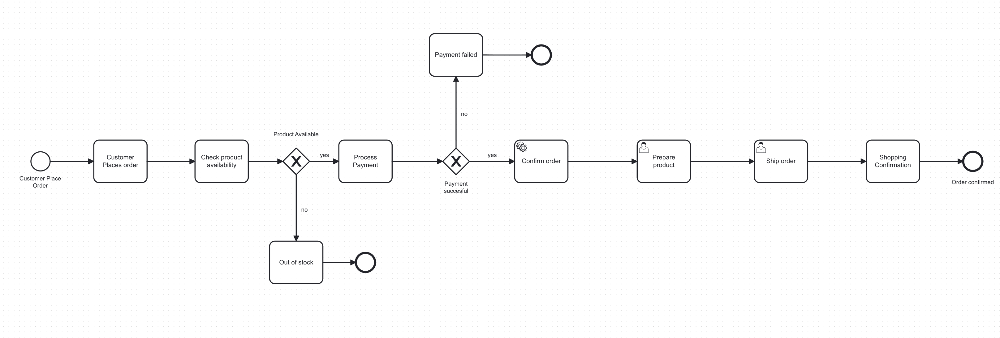
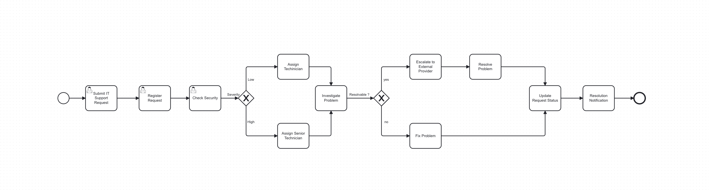

# BPMN Process Modeling

This project contains BPMN models for three business processes:

1. Employee Leave Approval
2. Online Purchase Order Processing
3. IT Service Request

---

## Scenario 1: Employee Leave Approval

### Description

### BPMN Diagram

This process models how an employee submits a leave request through the HR system. The system checks the employee's available leave balance before routing the request to the manager for approval.

### Flow Logic

1. **Start Event** – "Employee Submits Leave Request" triggers the process.
2. **User Task** – "Submit Leave Request": the employee submits the leave request.
3. **Service Task** – "Check Leave Balance": the HR system checks the available leave balance.
4. **Exclusive Gateway** – "Sufficient Balance?"

   * **No** → **Send Task** "Send Insufficient Balance Notification" → **End Event** "Insufficient Balance".
   * **Yes** → **Send Task** "Send Request to Manager for Approval".
5. **User Task** – "Manager Approval": the manager reviews the request.
6. **Exclusive Gateway** – "Manager Approves?"

   * **Approved** → **Service Task** "Update Employee Leave Balance" → **Send Task** "Send Approval Notification" → **End Event** "Leave Approved".
   * **Rejected** → **Send Task** "Send Rejection Notification" → **End Event** "Leave Rejected".

### Task Types

* **Submit Leave Request** → User Task
* **Check Leave Balance** → Service Task
* **Send Request to Manager for Approval** → Send Task
* **Manager Approval** → User Task
* **Update Employee Leave Balance** → Service Task
* **Send Approval Notification** → Send Task
* **Send Rejection Notification** → Send Task
* **Send Insufficient Balance Notification** → Send Task

---

## Scenario 2: Online Purchase Order Processing

### Description

This process models how an online purchase order is processed, starting when a customer places an order and ending with shipping confirmation or an appropriate failure notification.

### BPMN Diagram

### Flow Logic

1. **Start Event** – "Customer Places Order" triggers the process.
2. **User Task** – "Place Order": the customer places an order.
3. **Service Task** – "Check Product Availability": the system checks whether the product is available.
4. **Exclusive Gateway** – "Product Available?"

   * **No** → **Send Task** "Send Out-of-Stock Notification" → **End Event** "Product Unavailable".
   * **Yes** → **Service Task** "Process Payment".
5. **Exclusive Gateway** – "Payment Successful?"

   * **No** → **Send Task** "Send Payment Failure Notification" → **End Event** "Payment Failed".
   * **Yes** → **Service Task** "Confirm Order".
6. **User Task** – "Prepare Product for Shipment".
7. **User Task** – "Ship Order".
8. **Send Task** – "Send Shipping Confirmation to Customer".
9. **End Event** – "Order Completed".

### Task Types

* **Place Order** → User Task
* **Check Product Availability** → Service Task
* **Send Out-of-Stock Notification** → Send Task
* **Process Payment** → Service Task
* **Send Payment Failure Notification** → Send Task
* **Confirm Order** → Service Task
* **Prepare Product for Shipment** → User Task
* **Ship Order** → User Task
* **Send Shipping Confirmation to Customer** → Send Task

---

## Scenario 3: IT Service Request

### Description

This process models how an employee's IT support request is handled by the help desk and technicians. The process assigns technicians based on severity and allows unresolved problems to be escalated to an external service provider.

### BPMN Diagram

### Flow Logic

1. **Start Event** – "Employee Reports IT Problem" triggers the process.
2. **User Task** – "Submit IT Support Request": the employee submits the support request.
3. **User Task** – "Register Request": the help desk registers the request.
4. **User Task** – "Check Problem Severity": the help desk determines the severity.
5. **Exclusive Gateway** – "Problem Severity?"

   * **Low** → **User Task** "Assign to Support Technician".
   * **High** → **User Task** "Assign to Senior Technician".
6. Both paths continue to **User Task** "Investigate Problem".
7. **Exclusive Gateway** – "Can Problem Be Resolved?"

   * **Yes** → **User Task** "Fix Problem".
   * **No** → **Send Task** "Escalate to External Service Provider" → **User Task** "Resolve Problem".
8. After resolution, the process continues to **Service Task** "Update Request Status".
9. **Send Task** – "Send Resolution Notification".
10. **End Event** – "Request Resolved".

### Task Types

* **Submit IT Support Request** → User Task
* **Register Request** → User Task
* **Check Problem Severity** → User Task
* **Assign to Support Technician** → User Task
* **Assign to Senior Technician** → User Task
* **Investigate Problem** → User Task
* **Fix Problem** → User Task
* **Escalate to External Service Provider** → Send Task
* **Resolve Problem** → User Task
* **Update Request Status** → Service Task
* **Send Resolution Notification** → Send Task

---